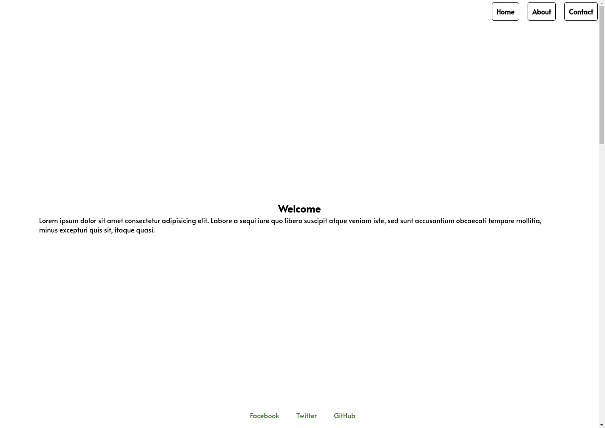

# Recreate Designs
Recreate the design of the images using HTML and CSS.

### Font (optional)
To use the same font add this line at the beginning of ypur css file:
```css
@import url('https://fonts.googleapis.com/css2?family=Alata&display=swap');
```

And use it like: `font-family: 'Alata', sans-serif;`

## Images

Index


About


Contact

